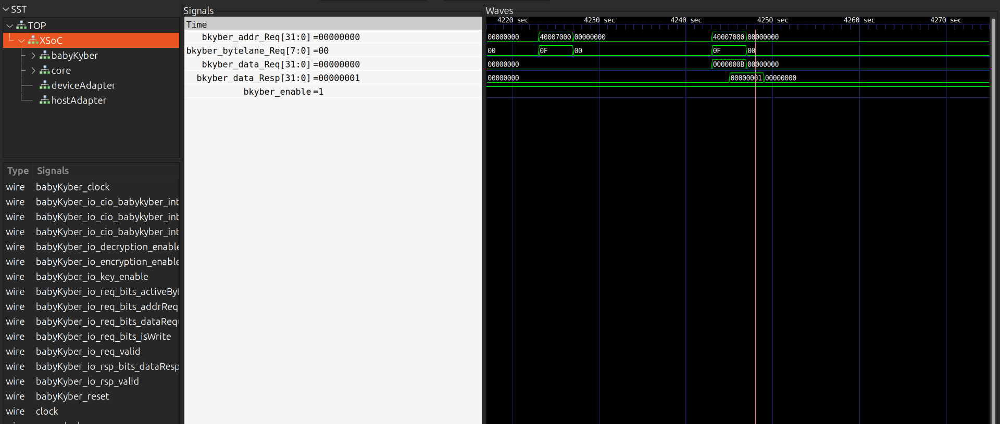

# XSoC-Lite: Modular RISC-V SoC Platform

**A complete hardware development platform featuring NucleusRV processor, BabyKyber accelerator, and advanced simulation capabilities**

## Overview
XSoC-Lite provides an open-source, modular RISC-V SoC platform designed for rapid prototyping and customization. Built around the NucleusRV processor core and integrated with the BabyKyber post-quantum cryptography accelerator, it delivers an efficient and versatile solution for hardware developers, researchers, and educators working on RISC-V-based systems.


## 🚀 Features

- **RISC-V ISA**: 32-bit RISC-V implementation with IMCF extensions
- **NucleusRV Core**: 5-stage pipelined processor design
- **BabyKyber Accelerator**: Post-quantum cryptography hardware acceleration
- **Caravan Bus Library**: Open-source bus protocol support in Chisel
- **Simulation Environment**: Verilator-based hardware simulation
- **Bare-Metal Programming**: XSoC-SDK for low-level software development
- **Modular Design**: Reusable and parametrized components
- **Open-Source**: Fully open development platform

## 🎯 Scope

### Processor Core
- **Base ISA**: RISC-V 32-bit Integer (RV32I) instruction set
- **Extensions**: Multiplication (M), Floating-Point (F), Compressed (C) support
- **Pipeline**: 5-stage implementation for efficient execution

### Hardware Accelerators
- **BabyKyber**: Post-quantum cryptography acceleration unit
- **Custom Extensions**: Framework for additional accelerator integration

### Bus Architecture
- **Caravan Bus**: Optimized interconnect for modular SoC design
- **Standard Protocols**: Support for industry-standard bus interfaces

### Development Tools
- **Simulation**: Verilator-based cycle-accurate simulation
- **Software SDK**: Complete bare-metal programming environment
- **Verification**: RISC-V architectural test suite compliance

## 🚀 Overview

XSoC-Lite is a comprehensive hardware development platform designed for research, education, and rapid prototyping of RISC-V SoCs. It integrates a 5-stage pipelined RISC-V CPU core with post-quantum cryptography acceleration capabilities, providing developers with a complete ecosystem for modern SoC design and implementation.

### Key Components

- **NucleusRV**: 5-stage pipelined RISC-V CPU core (RV32IMCF)
- **BabyKyber Accelerator**: Hardware accelerator for post-quantum cryptography
- **Caravan**: Open-source bus protocol library in Chisel
- **XSoC-SDK**: Complete software development kit for bare-metal programming

## 🛠️ Prerequisites

Before getting started, ensure you have the following installed:

### Essential Tools
```bash
# RISC-V GNU Toolchain
sudo apt-get install gcc-riscv64-unknown-elf

# Verilator (>= v5.002)
sudo apt-get install verilator

# Scala Build Tool
sudo apt-get install sbt

# Python 3
sudo apt-get install python3 python3-pip
```

### Verification
```bash
riscv32-unknown-elf-gcc --version
verilator --version
sbt --version
python3 --version
```

## 📦 Installation & Setup

### 1. Clone the Repository
```bash
git clone --recurse-submodules https://github.com/merledu/XSoC-Lite.git
cd XSoC-Lite
```


## 🎯 Quick Start Guide

### Running Your First Simulation

The easiest way to get started is running the default simulation:

```bash
python3 simulate.py
```

This will automatically run the default BabyKyber program from XSoC-SDK.



### Running Custom Programs

#### Option 1: Using Built-in Test Programs
```bash
# Run Fibonacci program
python3 simulate.py nucleusrv/tools/tests/fibonacci/main.c

# Run Hello World program  
python3 simulate.py nucleusrv/tools/tests/hello_world/main.c
```

## 📁 Project Structure

```
XSoC-Lite/
├── nucleusrv/                 # RISC-V CPU core
│   ├── src/                   # Chisel source files
│   ├── tools/                 # Development tools
│   │   └── tests/            # Test programs
│   │       ├── fibonacci/    # Fibonacci test
│   │       └── hello_world/  # Hello world test
│   └── simulate.py           # Main simulation script
├── BabyKyberAcceleratorCHISEL/ # Post-quantum crypto accelerator
├── caravan/                   # Bus protocol library
├── XSoC-SDK/                  # Software development kit
│   └── src/                   # SDK source files
├── simulate.py               # Repository-level simulation wrapper
└── build.sbt                # Scala build configuration
```


## 🤝 Contributing

### Submodule Development

Each submodule has its own development workflow:

1. **NucleusRV**: CPU core improvements and ISA extensions
2. **BabyKyber**: Cryptographic accelerator optimizations  
3. **Caravan**: Bus protocol enhancements
4. **XSoC-SDK**: Software library and driver development
